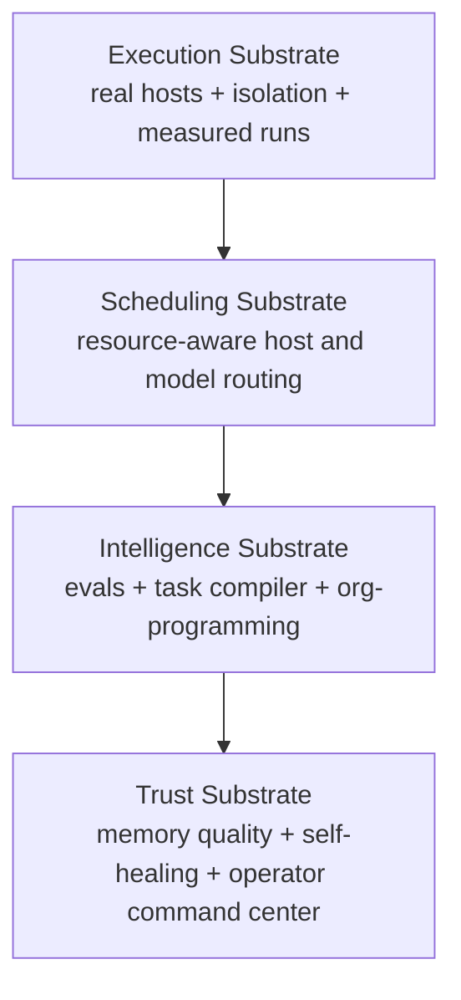
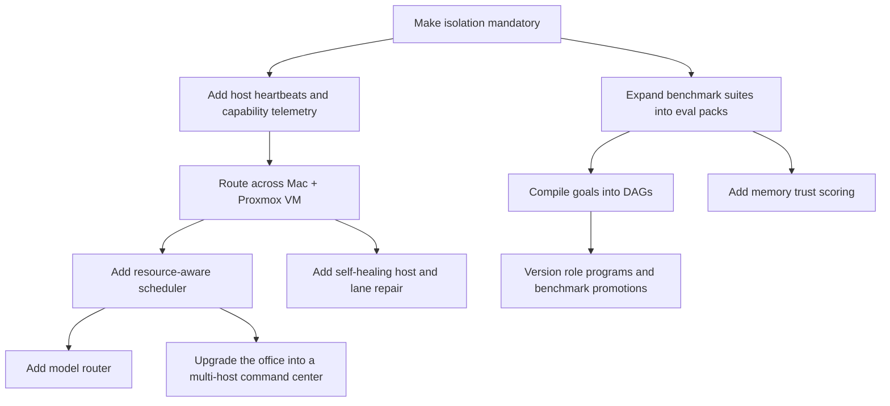

# Bleeding-Edge Execution Roadmap

## Purpose

This document is the implementation truth source for the next evolution of the MCP runtime.

It separates:

- features that are already real, shipped, and test-backed
- features that are partially implemented and ready for the next pass
- features that are intentionally not claimed as complete yet

## Current Baseline

The runtime now has a real execution and scheduling substrate for distributed-style task routing, isolated task execution, durable benchmark/eval evidence, measured model routing, versioned org programs, and compiled task DAGs.

Already implemented and verified:

- `worker.fabric`
  - durable host registry for local and SSH-backed worker hosts
  - host-aware worker slot expansion
  - effective local fallback fabric when no explicit remote hosts are configured
- isolation-by-default execution helpers
  - isolated workspaces outside the repo under `.mcp-isolation`
  - `git worktree` isolation when possible
  - fallback copy isolation when a repo/worktree path is not available
- tmux execution routing
  - host-aware lane IDs
  - task metadata stamped with host and isolation routing
  - local tmux command center with SSH-wrapped remote execution
- `benchmark.*`
  - durable benchmark suite registration
  - isolated benchmark execution on real hosts
  - run timeline evidence and artifact persistence
- `model.router`
  - durable backend registry
  - measured route scoring across latency, quality, context fit, cost, and host health
- `eval.*`
  - eval suites that compose real benchmark and router cases
- `org.program`
  - versioned role doctrine with promotion and rollback surfaces
- `task.compile`
  - durable plan compilation with owner contracts, evidence requirements, and rollback notes

Verified by tests:

- `worker.fabric can register a remote host and expose host-aware worker slots`
- `trichat.tmux_controller dispatches onto a configured remote host with isolation metadata`
- `benchmark.run executes a real isolated suite and records durable run evidence`
- `model.router persists backend state and routes by measured quality`
- `eval suite upsert/list/run composes benchmark and router cases against real state`
- `org.program and task.compile promote role doctrine into a durable plan`

## Roadmap Overview

## Phase 1: Execution Substrate

Status: partially shipped

### 1. Distributed Worker Fabric

Status: partially shipped

Already real:

- durable host config in `worker.fabric`
- local and SSH transports
- host-aware tmux lane assignment
- remote execution through SSH-wrapped commands

Already real:

- persistent host heartbeat and health scoring
- per-host telemetry for queue depth, CPU, GPU, RAM, disk, and thermal pressure
- operator-visible host state in kernel summary and tmux dashboard payloads

Still needed:

- worker lease renewal across remote hosts
- explicit remote bootstrap/install flow for new worker machines
- richer multi-host tabs in the office dashboard

Definition of done:

- Mac and Proxmox VM can both advertise capacity and accept tasks
- ring leader can route work by host capability instead of static preference

### 2. Isolation By Default

Status: shipped foundation, needs policy elevation

Already real:

- isolated workspaces are created for delegated execution
- tasks carry `task_execution.isolation_mode`
- remote and local execution both use the same isolation wrapper

Still needed:

- policy tiers that force `git_worktree`, `copy`, container, or VM isolation by task risk
- cleanup and retention policy for old isolated workspaces
- diff/merge harvesting from isolated workspaces back into operator review
- optional container and VM isolation executors

Definition of done:

- every delegated task is isolated by default
- higher-risk tasks escalate automatically into stronger boundaries

### 3. Real Benchmark and Eval Foundation

Status: shipped foundation and expanded into evals

Already real:

- benchmark suites are durable runtime objects
- cases execute for real in isolated workspaces
- run events and result artifacts are persisted

Still needed:

- broader named benchmark packs for delegation, tool-use, code-fix, research, recovery, and routing quality
- historical leaderboards and baseline comparisons
- automatic regression alerting when new org/program changes reduce win rate

Definition of done:

- ring leader, directors, SMEs, models, and routers all have benchmark coverage

## Phase 2: Scheduling Substrate

Status: foundation shipped

### 4. Resource-Aware Scheduling

Already real:

- live CPU, GPU, RAM, disk, queue depth, and thermal telemetry per host
- host scoring that combines capability, health, and current load
- routing policy for preferred host tags, hard requirements, and burst fallback

Still needed:

- live telemetry collection helpers for remote hosts
- scheduler feedback loop tied to real lease pressure and queue aging

Definition of done:

- tasks land on the best host because of measured conditions, not static guesses

### 5. True Model Router

Already real:

- runtime backend registry for `Ollama`, `MLX`, `llama.cpp`, `vLLM`, `OpenAI`, and custom backends
- measured latency, context-length, throughput, and win-rate telemetry per backend/model
- routing policy by task archetype and quality preference

Still needed:

- automatic backend heartbeat collectors
- fallback and circuit-breaker behavior for flaky or overloaded model backends
- tighter coupling between eval outcomes and router weight updates

Definition of done:

- the runtime chooses the best available model path per task automatically

## Phase 3: Intelligence Substrate

Status: foundation shipped

### 6. First-Class Eval System

Already real:

- benchmark suites promoted into a broader eval namespace
- router-case evals that validate real backend selection behavior

Still needed:

- stable seed tasks and goldens for:
  - delegation quality
  - tool correctness
  - research quality
  - code-fix success
  - recovery behavior
  - model-router choices
- score history and acceptance gates for org/program updates

### 7. True Task Compiler

Already real:

- goal-to-DAG compiler for owners, dependencies, evidence contracts, rollback contracts, and merge gates

Still needed:

- automatic plan slicing into richer parallel specialist workstreams
- planner output validation against policy and worker availability
- compile-time host/model hints based on task shape

### 8. Versioned Org Programming

Already real:

- versioned role programs for ring leader, directors, SMEs, and leaves
- promotion and rollback surfaces for role doctrine

Still needed:

- benchmark-backed promotion flow for new doctrine versions
- automatic use of active role programs inside all bridge prompts and planner hooks

## Phase 4: Trust and Operations

Status: planned

### 9. Higher-Trust Memory

Still needed:

- contradiction detection
- source weighting
- citation-grade lesson scoring
- memory invalidation and supersession workflow

### 10. Stronger Self-Healing Ops

Still needed:

- host quarantine
- flaky bridge isolation
- automatic lane restart and rehome
- queue poison detection
- degraded backend circuit breaking

### 11. Richer Command Center

Already real:

- host resource panels in the tmux dashboard payload and office briefing
- kernel summaries for worker fabric, model router, eval suites, and org programs

Still needed:

- multi-host tabs
- DAG view
- per-agent transcript panes
- backend/model badges
- queue provenance
- eval scoreboards

## Recommended Build Order

## Morning-After Operator Guidance

When bringing the stronger server online, use this sequence:

1. Register the new host through `worker.fabric`.
2. Verify isolated execution on that host with `benchmark.run`.
3. Only then allow the ring leader to route delegated work there.
4. Add real host telemetry before enabling load-aware scheduling.
5. Promote model routing only after benchmark baselines exist.

## Truthfulness Rules

This repo should only claim a feature as implemented when:

- there is a concrete runtime surface for it
- it executes against real local or remote state
- it has durable evidence or test coverage
- the operator surfaces read actual runtime state instead of mock placeholders
